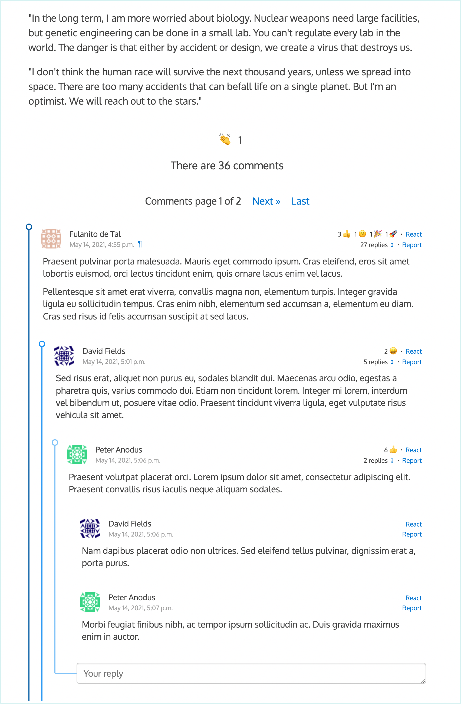

#  django-comments-ink &nbsp;&nbsp;&nbsp;&nbsp;&nbsp;  )

**Don't use it yet**: It's still under migration from django-comments-xtd to django-comments-ink.

A Django pluggable application that adds comments to your project.

The current master branch represents is a work-in-progress towards v3.0.0. It has not been released yet as a package in PyPI. The current stable version is based on the branch [v2](https://github.com/danirus/django-comments-ink/tree/v2) and is [available at PyPI](https://pypi.org/project/django-comments-ink/).

   

It extends [django-contrib-comments](https://pypi.python.org/pypi/django-contrib-comments) with the following features:

1. Comments can be nested.
1. Customizable maximum thread level.
1. Optional notifications on follow-up comments via email.
1. Mute links to allow cancellation of follow-up notifications.
1. Comment confirmation via email when users are not authenticated.
1. Authenticated users can send reactions to comments and to other objects.
1. Comment reactions and object reactions are customizable.
1. Comment voting, to list comments sorted by votes.
1. Comments pagination.
1. JavaScript plugin.

Example sites and tests work under officially Django [supported versions](https://www.djangoproject.com/download/#supported-versions>):

* Django 4.0, 3.2, 3.1
* Python 3.10, 3.9, 3.8

Additional Dependencies:

* django-contrib-comments >=2.2,<2.3
* djangorestframework >=3.12,<3.14

Check the sample sites:

 * [dci-project-quotes](https://github.com/comments-ink/dci-project-quotes): A project driven totally by Django, no JavaScript (yes, such sites still exist).
 * [dci-project-stories](https://github.com/comments-ink/dci-project-stories): This one uses both Django and the JavaScript plugin, 100% frontend framework free.
 * dci-with-bootstrap: Sample project to be done.
