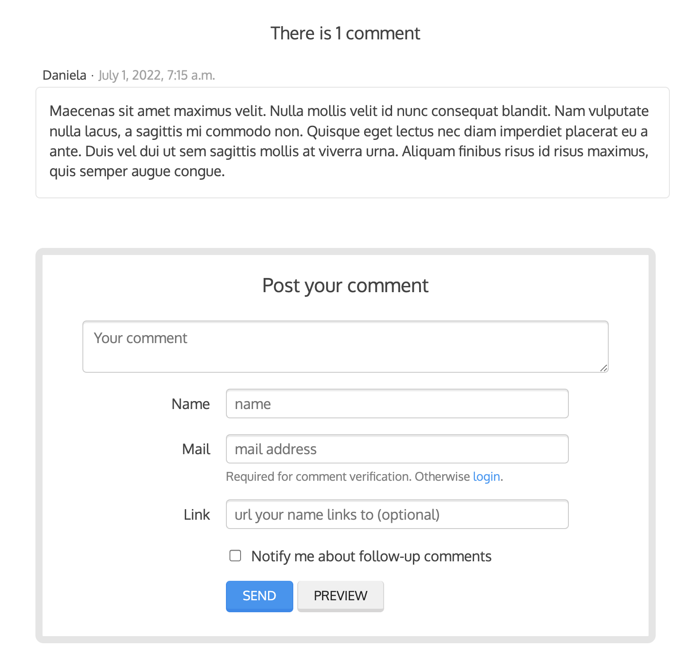

# Tutorial

This tutorial guides you through the steps to use every feature of django-comments-ink together with the [Django Comments Framework](https://github.com/django/django-contrib-comments). The Django project used throughout the tutorial is available in [GitHub](https://github.com/comments-ink/dci-quick-start). Following the tutorial will take about an hour, and it is highly recommended to get a comprehensive understanding of django-comments-ink.

## Introduction

Through the following sections the tutorial will cover the creation of a
simple blog with stories to which we will add comments, exercising each and
every feature provided by both, django-comments and django-comments-ink,
from comment post verification by email to comment moderation and nested
comments.

## Preparation

Before we install any package we will clone the [dci-quick-start](https://github.com/comments-ink/dci-quick-start) project and set up a virtual environment:

``` shell
git clone https://github.com/comments-ink/dci-quick-start
cd dci-quick-start
python3.10 -m venv venv
source venv/bin/activate
pip install -r requirements.txt
```

The only listed dependency in the `requirements.txt` file is django-comments-ink, and by installing it we install all its dependencies, which are Django, django-contrib-comments and django-rest-framework. After installing them we are ready to work on the project. Take a look at the content of the `quick_start` directory, it contains:

 * A **blog** app with a **Post** model.
 * A **users** app with a **User** model defined as the `AUTH_USER_MODEL`.
 * A **quick_start** directory with the **settings** and **urls** modules.
 * A **templates** directory, with the blog templates and the users templates.
 * A **static** directory with a **main.css** file.
 * A **fixtures** directory with data files.

Let's finish the initial setup, load the fixtures and run the development
server:

``` shell
cd quick_start
python manage.py migrate
python manage.py loaddata ../fixtures/*.json
python manage.py runserver
```

Take a look at the initial state of the quick-start project: [http://localhost:8000](http://localhost:8000).

!!! note "Implement `get_absolute_url` in the model that can receive comments"

    Remember to implement the `get_absolute_url` method in the model class whose objects can receive comments. That is the case of the class `Post` in the quick-start project. It is so because the permanent URL of each comment uses the `shortcut` view of `django.contrib.contenttypes` which in turn uses the `get_absolute_url` method.

## Configuration

Now that the project is running we are ready to add comments. Edit the settings
module, `quick_start/settings.py`, and make the following changes:

``` py
INSTALLED_APPS = [
    ...
    'django_comments_ink',
    'django_comments',
    'users',
    'blog',
]
...
COMMENTS_APP = 'django_comments_ink'

DEFAULT_FROM_EMAIL = "Helpdesk <helpdesk@yourdomain>"

# Either enable sending mail messages to the console...
EMAIL_BACKEND = 'django.core.mail.backends.console.EmailBackend'

# ... or set up the EMAIL_* settings so that Django can send emails.
EMAIL_HOST = "smtp.mail.com"
EMAIL_PORT = "587"
EMAIL_HOST_USER = "alias@mail.com"
EMAIL_HOST_PASSWORD = "yourpassword"
EMAIL_USE_TLS = True
```

Edit the urls module of the project, `quick_start/urls.py` and mount
the URL patterns of django_comments_ink in the path `/comments/`. The urls
installed with django_comments_ink include django_comments' urls too:

``` py
from django.urls import include, path

urlpatterns = [
    ...
    path('comments/', include('django_comments_ink.urls')),
    ...
]
```

Now let Django create the tables for the two new applications:

``` shell
python manage.py migrate
```

Be sure that the domain field of the `Site` instance points to the correct
domain. For the development server it is expected to be `localhost:8000`.
The value is used to create comment verifications, follow-up cancellations,
etc. Use the user `admin@example.com` with password `admin` to login in the [admin interface](http://localhost:8000/admin/) and verify that the [site instance](http://localhost:8000/admin/sites/site/1) corresponds to the URL in use by the development server. If you run the development server in a port other than 8000 you will have to update the `Site` instance to refer to the port you are using.

### Comment confirmation

Before we go any further we need to set up the `COMMENTS_INK_SALT`
setting. This setting plays an important role during the comment confirmation
by mail. It helps obfuscating the comment before the user approves its
publication.

It is so because django-comments-ink does not store comments in the server
until they have been confirmed. This way there is little to none possible
comment spam flooding into the database. Comments are encoded in URLs and sent
for confirmation by mail. Only when the user clicks the confirmation URL the
comment lands in the database.

This behaviour is disabled for authenticated users, and can be disabled for
anonymous users too by simply setting `COMMENTS_INK_CONFIRM_EMAIL` to
`False`.

Now let's append the following entries to the `quick_start/settings.py` module:

``` py
#  To help obfuscating comments before they are sent for confirmation.
COMMENTS_INK_SALT = (b"Timendi causa est nescire. "
                     b"Aequam memento rebus in arduis servare mentem.")

# Source mail address used for notifications.
COMMENTS_INK_FROM_EMAIL = "webmaster@example.com"

# Contact mail address to show in messages.
COMMENTS_INK_CONTACT_EMAIL = "helpdesk@example.com"
```

## Template changes

It is time to make changes in the two templates of the blog application:

 * In `templates/blog/post_detail.html` and
 * In `templates/blog/post_list.html`

### The detail template

Next step consist of editing the `templates/blog/post_detail.html` file and loading the `comments` and the `comments_ink` templatetag modules:

``` HTML






```

Before the `content` block add the `extra_css` block, defined in the `templates/base.html` file, so that we load the `comments.css` stylesheet:

``` HTML

<link
    rel="stylesheet" type="text/css"
    href=""
>

```

Now we will change the template to:

 1. Show the number of comments posted to the blog post,
 1. List the comments already posted, and
 1. Show the comment form, so that comments can be sent.

By using the `get_inkcomment_count` template tag we will get the number of comments posted. At the end of the `content` block and before the closing tag of the `<article>` HTML element, add the following content:

``` HTML
    <div class="dci">
      
      
        <h6 class="text-center">
          
          There is {{ comment_count }} comment
          
          There are {{ comment_count }} comments
          
        </h6>
      
    </div>
```

Given that we have not sent any comment yet we won't see any change in the rendering of the blog posts.

Now let's add the code to list the comments posted to the story. We can make
use of three template tags, `render_comment_list` and `get_comment_list` from the django-contrib-comments package, and `render_inkcomment_list` from django-comments-ink. Here we will use the last: `render_inkcomment_list`. It caches the list of comments and allows for rendering nested comments.

When using `render_inkcomment_list`, with a `blog.post` object, Django will look for the template `list.html` in the following directories:

 * `comments/blog/post/list.html`
 * `comments/blog/list.html`
 * `comments/list.html`

If we were specifying one of the themes provided with django-comments-ink Django would look for the template in more directories, but for now we use the default theme.

Given that the quick-start project doesn't have a `templates/comments` directory, when using the `render_inkcomment_list` Django will use the template `comments/list.html` provided by django-comments-ink.

Add the following code to the `post_detail.html` template, right before the closing tag `</article>`:

``` HTML
    
      <div class="dci pb32">
        
      </div>
    
```

As before, due to the lack of posted comments we won't see any change in any of the blog post webpages. So let's finish the changes in the `post_detail.html` template. And send some comments.

Below the tag that list the comments we want to display the comment form. There are three template tags available for that purpose, `render_comment_form` and `get_comment_form` provided by django-contrib-comments, and `render_inkcomment_form` provided by django-comments-ink.

Add the following code right before the closing tag `</article>`:

``` HTML
    <div class="dci" data-dci="comment-form">
      <section class="comment-form">
      <h5 class="text-center"></h5>
      
      </section>
    </div>
```

Now we are ready to send comments. If you are logged in in the admin interface your comments won't need to be confirmed by email. To test the confirmation URL do logout of the admin interface. Bear in mind that `EMAIL_BACKEND` is set up to send email messages to the console, so look in the console after you post the comment and find the first long URL in the message. To confirm the comment copy the link and paste it in the location bar of the browser.

### The list template

If you have sent some comments you must be able to see them listed in the blog post webpage. Let's update now the `templates/blog/post_list.html` template so that we show the number of comments along with the title of each blog post in the post list.

Edit the `templates/blog/post_list.html` and modify the code to load the **static** and **comments** modules:

``` HTML





```

Before the `content` block add the `extra_css` block (defined in `base.html`) so that we load the `comments.css` stylesheet:

``` HTML

<link
    rel="stylesheet" type="text/css"
    href=""
>

```

Within the `content` block, modify the template to look like in the following snippet:

``` HTML
    
      
        <div>
          <h6 class="inline flex flex-align-center">
            <a href="{{ object.get_absolute_url }}">{{ object.title }}</a>
            - <span class="small">{{ object.publish|date:"d-F-Y" }}</span>
            
            - <span class="emoji small">&#128172;</span>
            <span class="small">{{ comment_count }}</span>
            
          </h6>
        {{ object.body|truncatewords:30|linebreaks }}
      </div>
    
```

The setting `COMMENTS_XTD_MAX_THREAD_LEVEL` is ``0`` by default, which means comments can not be nested. Later in the threads section we will enable nested comments. Now we will set up comment moderation.

<figure markdown>
  
</figure>

## Moderation

One of the differences between django-comments-ink and other commenting applications is the fact that by default it requires comment confirmation by
email when users are not logged in, a very effective feature to discard unwanted
comments. However there might be cases in which you would prefer a different
approach. The Django Comments Framework comes with [moderation capabilities](http://django-contrib-comments.readthedocs.io/en/latest/moderation.html) included, on top of which you can build your own comment filtering.

Comment moderation is often established to fight spam, but may be used for other
purposes, like triggering actions based on comment content, rejecting comments
based on how old is the subject being commented and whatnot.

In this section we want to set up comment moderation for our blog application,
so that comments sent to a blog post older than a year will be automatically
flagged for moderation. Also we want Django to send an email to registered
`MANAGERS` of the project when the comment is flagged.

Let's start adding our email address to the `MANAGERS` in the `quick_start/settings.py` module:

``` py
MANAGERS = (
    ('Joe Bloggs', 'joe.bloggs@example.com'),
)
```

Now we will create a new `Moderator` class that inherits from django-contrib-comments' `CommentModerator`. This class enables moderation by defining a
number of class attributes. Read more about it in [moderation options](https://django-contrib-comments.readthedocs.io/en/latest/moderation.html#moderation-options), in the official documentation of the Django Comments
Framework.

We will also register our `Moderator` class with the django-comments-ink's
`moderator` object. We use django-comments-ink's object instead of
django-contrib-comments' because we still want to have confirmation by email
for non-registered users, nested comments, follow-up notifications, etc.

Let's add those changes to the `blog/model.py` file:

``` py
# Append these imports below the current ones.
from django_comments.moderation import CommentModerator
from django_comments_ink.moderation import moderator


# Add this code at the end of the file.
class PostCommentModerator(CommentModerator):
    email_notification = True
    auto_moderate_field = 'publish'
    moderate_after = 365


moderator.register(Post, PostCommentModerator)

```

That makes it, moderation is ready. Visit any of the blog posts with a
`publish` datetime older than a year and try to send a comment. After
confirming the comment you will see the `comments/moderated.html`
template, and your comment will be put on hold for approval.

If on the other hand you send a comment to a blog post created within the last
year (login in the admin interface and update the publish field of the post)
your comment will not be put in moderation. Give it a try as a logged in
user and as an anonymous user.

When sending a comment as a logged-in user the comment won't have to be
confirmed and will be put in moderation immediately. However, when you send it
as an anonymous user the comment will have to be confirmed by clicking on the
confirmation link, immediately after that the comment will be put on hold
pending for approval.

In both cases, due to the attribute `email_notification = True` above, all
mail addresses listed in the `MANAGERS` setting will receive a notification about the reception of a new comment. If you did not received such message, you might need to review your email settings, or the console output. Read about the mail settings above in the `configuration` section.

The mail message received is based on the `comments/comment_notification_email.txt` template provided with django-comments-ink.

!!! note "Review comments pending for moderation and eventually approve them"

    Don't forget to visit the comments-ink app in the admin interface. Filter comments by `is public: No` and `is removed: No`. Tick the box of those you want to approve, choose **Approve selected comments** in the **action** dropdown, at the top left of the comment list, and click on the **Go** button.

### Disallow black listed domains

In case you wanted to disable comment confirmation by email you might want to
set up some sort of control to reject spam.

This section goes through the steps to disable comment confirmation while
enabling a comment filtering solution based on Joe Wein's [blacklist](http://www.joewein.net/spam/blacklist.htm) of spamming domains. We will also add a moderation function that will put in moderation comments containing [badwords](https://gist.github.com/ryanlewis/a37739d710ccdb4b406d).

Let us first disable comment confirmation. Edit the `quick_start/settings.py`
file and add:

``` py
COMMENTS_INK_CONFIRM_EMAIL = False
```

django-comments-ink comes with a `Moderator` class that inherits from
`CommentModerator` and implements a method `allow` that will do the
filtering for us. We just have to change `blog/models.py` and replace
`CommentModerator` with `SpamModerator`, as follows:

``` py
# Remove the CommentModerator imports and leave only this:
from django_comments_ink.moderation import moderator, SpamModerator

# Our class Post PostCommentModerator now inherits from SpamModerator
class PostCommentModerator(SpamModerator):
    email_notification = True
    auto_moderate_field = 'publish'
    moderate_after = 365


moderator.register(Post, PostCommentModerator)
```

Now we can add a domain to the `BlackListed` model in the [admin](http://localhost:8000) interface. Or we could download a [blacklist](http://www.joewein.net/spam/blacklist.htm) from Joe Wein's website and load the table with actual spamming domains.

Once we have a `BlackListed` domain, try to send a new comment and use an
email address with such a domain. Be sure to log out before trying, otherwise
django-comments-ink will use the logged in user credentials and ignore the
email given in the comment form.

Sending a comment with an email address of the blacklisted domain triggers a
**Comment post not allowed** response, which would have been a HTTP 400 Bad
Request response with `DEBUG = False` in production.

### Moderate on bad words

Let's now create our own Moderator class by subclassing `SpamModerator`. The
goal is to create a `moderate` method that looks in the content of the
comment and returns `False` whenever it finds a bad word in the message. The
effect of returning `False` is that the `is_public` attribute of the comment will be put to `False` and therefore the comment will be in moderation.

The blog application comes with a bad word list in the
file `blog/badwords.py`.

We assume we already have a list of `BlackListed` domains and we don't need
further spam control. So we will disable comment confirmation by email. Edit
the `settings.py` file:

``` py
COMMENTS_INK_CONFIRM_EMAIL = False
```

Now edit `blog/models.py` and add the code corresponding to our new
`PostCommentModerator`:

``` py
# Below the other imports:
from django_comments_ink.moderation import moderator, SpamModerator

from blog.badwords import badwords


# At the bottom of the file.
class PostCommentModerator(SpamModerator):
    email_notification = True

    def moderate(self, comment, content_object, request):
        # Make a dictionary where the keys are the words of the message
        # and the values are their relative position in the message.
        def clean(word):
            ret = word
            if word.startswith('.') or word.startswith(','):
                ret = word[1:]
            if word.endswith('.') or word.endswith(','):
                ret = word[:-1]
            return ret

        lowcase_comment = comment.comment.lower()
        msg = dict([
            (clean(w), i) for i, w in enumerate(lowcase_comment.split())
        ])
        for badword in badwords:
            if isinstance(badword, str):
                if lowcase_comment.find(badword) > -1:
                    return True
            else:
                lastindex = -1
                for subword in badword:
                    if subword in msg:
                        if lastindex > -1:
                            if msg[subword] == (lastindex + 1):
                                lastindex = msg[subword]
                        else:
                            lastindex = msg[subword]
                    else:
                        break
                if msg.get(badword[-1]) and msg[badword[-1]] == lastindex:
                    return True
        return super(PostCommentModerator, self).moderate(
            comment, content_object, request
        )


moderator.register(Post, PostCommentModerator)
```

Now we can try to send a comment with any of the bad words listed in [badwords](https://gist.github.com/ryanlewis/a37739d710ccdb4b406d). After sending the comment we will see the content of the `comments/moderated.html` template and the comment will be put in moderation.

If you enable comment confirmation by email, the comment will be put on hold
after the user clicks on the confirmation link in the email.

## Threads

Up until this point in the tutorial django-comments-ink has been configured to
disallow nested comments. Every comment is at thread level 0. It is so because
by default the `COMMENTS_INK_MAX_THREAD_LEVEL` setting is 0.

When `COMMENTS_INK_MAX_THREAD_LEVEL` is greater than 0, comments below the maximum thread level may receive replies that will nest inside each
other up to the maximum thread level. A comment in a the thread level below
the :setting:`COMMENTS_XTD_MAX_THREAD_LEVEL` can show a **Reply** link that
allows users to send nested comments.

In this section we will enable nested comments by modifying `COMMENTS_INK_MAX_THREAD_LEVEL` and apply some changes to our `blog/post_detail.html` template.

We will also introduce the setting :setting:`COMMENTS_INK_LIST_ORDER`, that
allows altering the default order in which the comments are sorted in the list.
By default comments are sorted by thread and their position inside the thread,
which turns out to be in ascending datetime of arrival. In this example we will
list newer comments first.

Let's start by editing the ``quick_start/settings.py`` module to establish the maximum thread level to 1 and a comment ordering such that newer comments are retrieved first:

``` py
COMMENTS_INK_MAX_THREAD_LEVEL = 1  # Default is 0.

# Default is ('thread_id', 'order').
COMMENTS_INK_LIST_ORDER = ('-thread_id', 'order')
```

Now visit any of the blog posts to which you have already sent comments and see
that a new `Reply` link shows up below each comment. Click on the link and post
a new comment. It will appear nested inside the parent comment. The new comment
will not show a `Reply` link because `COMMENTS_INK_MAX_THREAD_LEVEL` has been set to 1.

<figure markdown>
  
</figure>

### Different max thread levels

There might be cases in which nested comments have a lot of sense and others
in which we would prefer a plain comment sequence. We can handle both scenarios
under the same Django project.

We just have to use both settings:

 1. `COMMENTS_INK_MAX_THREAD_LEVEL`, and
 1. `COMMENTS_INK_MAX_THREAD_LEVEL_BY_APP_MODEL`

 The first establishes the default maximum thread level site wide, while the second sets the maximum thread level on `app.model` basis.

If we wanted to disable nested comments site wide, and enable nested comments
up to level one for blog posts, we would set it up as follows in our `settings.py` module:

``` py
COMMENTS_INK_MAX_THREAD_LEVEL = 0  # site wide default
COMMENTS_INK_MAX_THREAD_LEVEL_BY_APP_MODEL = {
    # Objects of the app blog, model post, can be nested
    # up to thread level 1.
    'blog.post': 1,
}
```

You can change the maximum thread level and the list of comments will update to it. After changing the maximum thread level we have to run the `update_nested_comments` command. This command updates the value of the field `nested_count` of each comment.

### The `nested_count` field

When threaded comments are enabled the field `nested_count` of every **InkComment** instance keeps track of how many nested comments it contains.

Therefore, if a site has comments at a given level N, and you updated the maximum thread level to N-1, all the comments from level 0 to level N-1 should get an updated `nested_count` value. To update the `nested_count` field for every comment simply run the `update_nested_count` management command. The comments at level N will not be deleted but simply ignored.

## Extended options

Comments provided by django-comments-ink have additional features that allow users to express opinions about their content. The additional commenting options are:

 * Removal suggestion.
 * Comment votes.
 * Comment reactions.

In addition django-comments-ink extends the capability to send reactions to other objects. Say, if a blog post can receive comments it could also receive reactions. This way users can send likes or dislikes to blog posts, or claps as in the popular publishing site [Medium](https://medium.com).


### Removal suggestion

#### Getting notifications

### Comment votes

### Comment reactions

### Object reactions


## JavaScript plugin

### The i18n JavaScript Catalog

### Load the plugin

## Final notes
